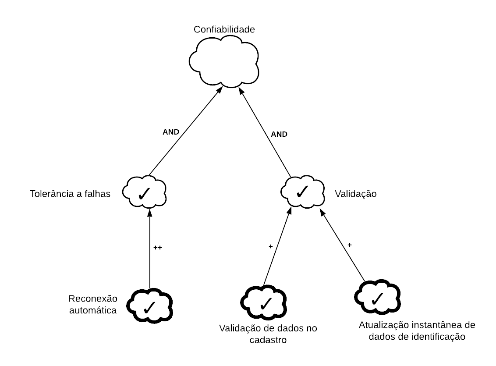
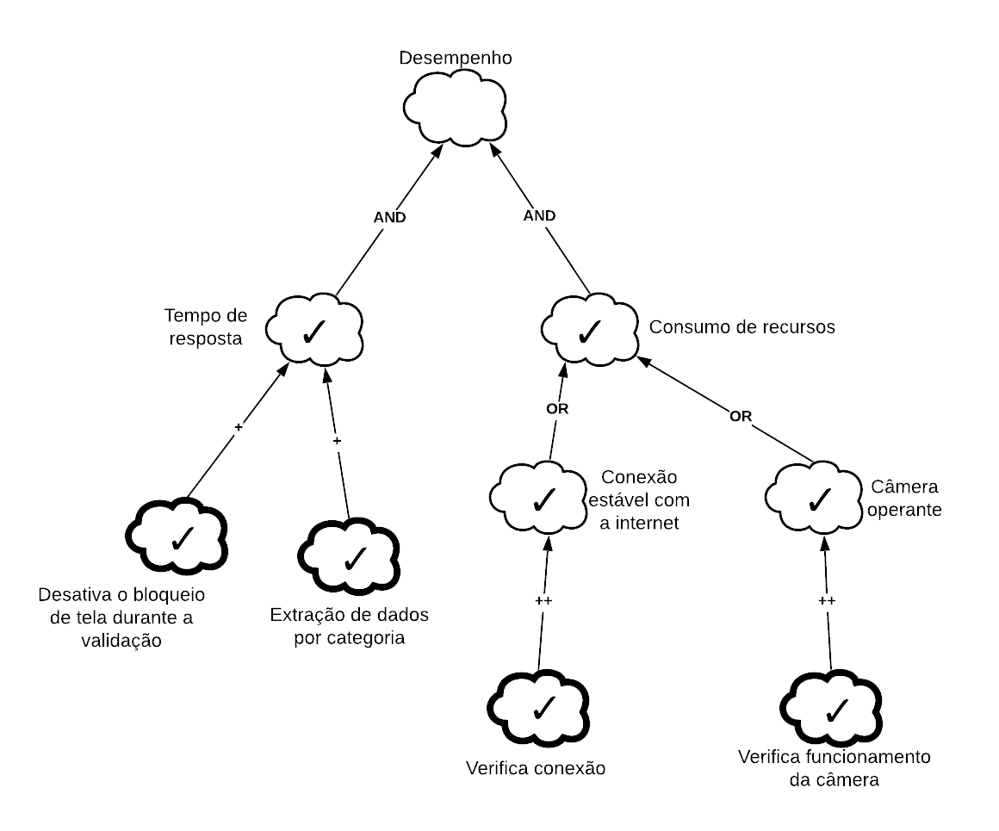
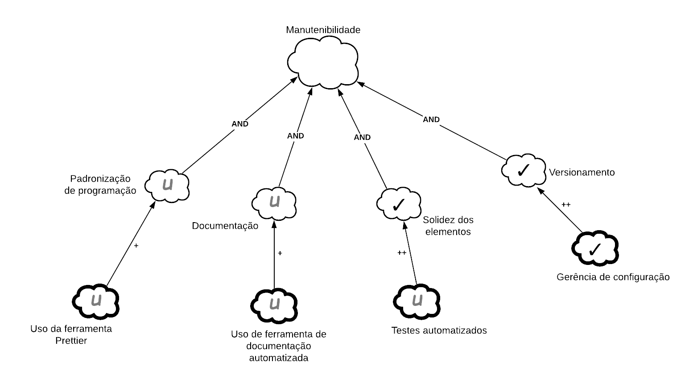

## 1. Introdução

 
A verificação busca garantir que os produtos de trabalhos selecionados cumpram os requisitos especificados. Nesse sentido, aqui os requisitos se tratam de padrões e práticas utilizados para a elaboração dos artefatos desenvolvidos pelo grupo. Aqui, a verificação desses artefatos será realizada por meio da revisão, que tem objetivo de verificar nesses a conformidade com padrões e descobrir problemas e omissões.

## 2. Inspeção

 
A técnica de revisão utilizada será a Inspeção de Fagan, que é um processo tradicional e detalhado de se realizar uma revisão. O autor descreve o processo em seis atividades principais: planejamento, apresentação (que pode ser omitida), preparação, reunião, retrabalho e continuação (que aqui não será aplicada).

## 3. Preparação

 
Nesta verificação, o grupo decidiu ter como inspetor o aluno Guilherme de Morais, que a partir do estudo dos artefatos individualmente, produziu uma lista de prováveis discrepâncias a serem encontradas, que aqui é chamada de checklist.

 
Quanto ao artefato do <a href="../../../modelagem/nfrFramework">NFR Framework</a>, a checklist se encontra da seguinte forma:

| Número | Questão                                                                                |
| :----: | -------------------------------------------------------------------------------------- |
|   1    | O SIG aborda um requisito relevante?                                                   |
|   2    | O SIG está estruturado em conformidade?                                                |
|   3    | Os softgoals deste SIG representam requisitos verdadeiramente não-funcionais?          |
|   4    | Os softgoals de operacionalização estão representados fielmente para os NFR softgoals? |
|   5    | Os softgoals possuem claims corretamente estruturados?                                 |
|   6    | As contribuições estão corretamente organizadas?                                       |
|   7    | Os rótulos são realmente satisfeitos conforme estão marcados?                          |
|   8    | O artefato está corretamente legível?                                                  |
|   9    | As estruturas visuais estão correspondentes com o que se deseja apresentar?            |
|   10   | É possível entender o artefato por alguém que não seja quem desenvolveu?               |
|   11   | Os grafos possuem informações exageradas ou desnecessárias?                            |

<figcaption>Tabela 1 - Checklist</figcaption>

Assim, a checklist foi utilizada para verificar os grafos SIG que compõem o artefato relativo ao NFR Framework.

### 3.1 Geral

| Número | Questão                                                                                | Resposta |
| :----: | -------------------------------------------------------------------------------------- | :------: |
|   1    | O SIG aborda um requisito relevante?                                                   | &#10004  |
|   2    | O SIG está estruturado em conformidade?                                                | &#10004  |
|   3    | Os softgoals deste SIG representam requisitos verdadeiramente não-funcionais?          | &#10004  |
|   4    | Os softgoals de operacionalização estão representados fielmente para os NFR softgoals? | &#10004  |
|   5    | Os softgoals possuem claims corretamente estruturados?                                 | &#10004  |
|   6    | As contribuições estão corretamente organizadas?                                       | &#10006  |
|   7    | Os rótulos são realmente satisfeitos conforme estão marcados?                          |    -     |
|   8    | O artefato está corretamente legível?                                                  | &#10004  |
|   9    | As estruturas visuais estão correspondentes com o que se deseja apresentar?            | &#10004  |
|   10   | É possível entender o artefato por alguém que não seja quem desenvolveu?               | &#10004  |
|   11   | Os grafos possuem informações exageradas ou desnecessárias?                            | &#10004  |

<figcaption>Tabela 2 - Verificação sobre o SIG Geral</figcaption>

### 3.2 Confiabilidade

| Número | Questão                                                                                | Resposta |
| :----: | -------------------------------------------------------------------------------------- | :------: |
|   1    | O SIG aborda um requisito relevante?                                                   | &#10004  |
|   2    | O SIG está estruturado em conformidade?                                                | &#10004  |
|   3    | Os softgoals deste SIG representam requisitos verdadeiramente não-funcionais?          | &#10004  |
|   4    | Os softgoals de operacionalização estão representados fielmente para os NFR softgoals? | &#10004  |
|   5    | Os softgoals possuem claims corretamente estruturados?                                 | &#10004  |
|   6    | As contribuições estão corretamente organizadas?                                       | &#10004  |
|   7    | Os rótulos são realmente satisfeitos conforme estão marcados?                          | &#10006  |
|   8    | O artefato está corretamente legível?                                                  | &#10004  |
|   9    | As estruturas visuais estão correspondentes com o que se deseja apresentar?            | &#10004  |
|   10   | É possível entender o artefato por alguém que não seja quem desenvolveu?               | &#10004  |
|   11   | Os grafos possuem informações exageradas ou desnecessárias?                            | &#10004  |

<figcaption>Tabela 3 - Verificação sobre o SIG Confiabilidade</figcaption>

### 3.3 Custo

| Número | Questão                                                                                | Resposta |
| :----: | -------------------------------------------------------------------------------------- | :------: |
|   1    | O SIG aborda um requisito relevante?                                                   | &#10004  |
|   2    | O SIG está estruturado em conformidade?                                                | &#10004  |
|   3    | Os softgoals deste SIG representam requisitos verdadeiramente não-funcionais?          | &#10004  |
|   4    | Os softgoals de operacionalização estão representados fielmente para os NFR softgoals? | &#10004  |
|   5    | Os softgoals possuem claims corretamente estruturados?                                 | &#10004  |
|   6    | As contribuições estão corretamente organizadas?                                       | &#10004  |
|   7    | Os rótulos são realmente satisfeitos conforme estão marcados?                          | &#10006  |
|   8    | O artefato está corretamente legível?                                                  | &#10004  |
|   9    | As estruturas visuais estão correspondentes com o que se deseja apresentar?            | &#10004  |
|   10   | É possível entender o artefato por alguém que não seja quem desenvolveu?               | &#10004  |
|   11   | Os grafos possuem informações exageradas ou desnecessárias?                            | &#10004  |

<figcaption>Tabela 4 - Verificação sobre o SIG Custo</figcaption>

### 3.4 Desempenho

| Número | Questão                                                                                | Resposta |
| :----: | -------------------------------------------------------------------------------------- | :------: |
|   1    | O SIG aborda um requisito relevante?                                                   | &#10004  |
|   2    | O SIG está estruturado em conformidade?                                                | &#10004  |
|   3    | Os softgoals deste SIG representam requisitos verdadeiramente não-funcionais?          | &#10004  |
|   4    | Os softgoals de operacionalização estão representados fielmente para os NFR softgoals? | &#10004  |
|   5    | Os softgoals possuem claims corretamente estruturados?                                 | &#10004  |
|   6    | As contribuições estão corretamente organizadas?                                       | &#10004  |
|   7    | Os rótulos são realmente satisfeitos conforme estão marcados?                          | &#10006  |
|   8    | O artefato está corretamente legível?                                                  | &#10004  |
|   9    | As estruturas visuais estão correspondentes com o que se deseja apresentar?            | &#10004  |
|   10   | É possível entender o artefato por alguém que não seja quem desenvolveu?               | &#10004  |
|   11   | Os grafos possuem informações exageradas ou desnecessárias?                            | &#10004  |

<figcaption>Tabela 5 - Verificação sobre o SIG Desempenho</figcaption>

### 3.5 Manutenibilidade

| Número | Questão                                                                                | Resposta |
| :----: | -------------------------------------------------------------------------------------- | :------: |
|   1    | O SIG aborda um requisito relevante?                                                   | &#10004  |
|   2    | O SIG está estruturado em conformidade?                                                | &#10004  |
|   3    | Os softgoals deste SIG representam requisitos verdadeiramente não-funcionais?          | &#10004  |
|   4    | Os softgoals de operacionalização estão representados fielmente para os NFR softgoals? | &#10004  |
|   5    | Os softgoals possuem claims corretamente estruturados?                                 | &#10004  |
|   6    | As contribuições estão corretamente organizadas?                                       | &#10004  |
|   7    | Os rótulos são realmente satisfeitos conforme estão marcados?                          | &#10006  |
|   8    | O artefato está corretamente legível?                                                  | &#10004  |
|   9    | As estruturas visuais estão correspondentes com o que se deseja apresentar?            | &#10004  |
|   10   | É possível entender o artefato por alguém que não seja quem desenvolveu?               | &#10004  |
|   11   | Os grafos possuem informações exageradas ou desnecessárias?                            | &#10004  |

<figcaption>Tabela 6 - Verificação sobre o SIG Manutenibilidade</figcaption>

### 3.6 Segurança

| Número | Questão                                                                                | Resposta |
| :----: | -------------------------------------------------------------------------------------- | :------: |
|   1    | O SIG aborda um requisito relevante?                                                   | &#10004  |
|   2    | O SIG está estruturado em conformidade?                                                | &#10004  |
|   3    | Os softgoals deste SIG representam requisitos verdadeiramente não-funcionais?          | &#10004  |
|   4    | Os softgoals de operacionalização estão representados fielmente para os NFR softgoals? | &#10004  |
|   5    | Os softgoals possuem claims corretamente estruturados?                                 | &#10004  |
|   6    | As contribuições estão corretamente organizadas?                                       | &#10004  |
|   7    | Os rótulos são realmente satisfeitos conforme estão marcados?                          | &#10006  |
|   8    | O artefato está corretamente legível?                                                  | &#10004  |
|   9    | As estruturas visuais estão correspondentes com o que se deseja apresentar?            | &#10004  |
|   10   | É possível entender o artefato por alguém que não seja quem desenvolveu?               | &#10004  |
|   11   | Os grafos possuem informações exageradas ou desnecessárias?                            | &#10004  |

<figcaption>Tabela 7 - Verificação sobre o SIG Segurança</figcaption>

### 3.7 Usabilidade

| Número | Questão                                                                                | Resposta |
| :----: | -------------------------------------------------------------------------------------- | :------: |
|   1    | O SIG aborda um requisito relevante?                                                   | &#10004  |
|   2    | O SIG está estruturado em conformidade?                                                | &#10004  |
|   3    | Os softgoals deste SIG representam requisitos verdadeiramente não-funcionais?          | &#10004  |
|   4    | Os softgoals de operacionalização estão representados fielmente para os NFR softgoals? | &#10004  |
|   5    | Os softgoals possuem claims corretamente estruturados?                                 | &#10004  |
|   6    | As contribuições estão corretamente organizadas?                                       | &#10004  |
|   7    | Os rótulos são realmente satisfeitos conforme estão marcados?                          | &#10006  |
|   8    | O artefato está corretamente legível?                                                  | &#10004  |
|   9    | As estruturas visuais estão correspondentes com o que se deseja apresentar?            | &#10004  |
|   10   | É possível entender o artefato por alguém que não seja quem desenvolveu?               | &#10004  |
|   11   | Os grafos possuem informações exageradas ou desnecessárias?                            | &#10004  |

<figcaption>Tabela 8 - Verificação sobre o SIG Usabilidade</figcaption>

### 3.8 Portabilidade

| Número | Questão                                                                                | Resposta |
| :----: | -------------------------------------------------------------------------------------- | :------: |
|   1    | O SIG aborda um requisito relevante?                                                   | &#10004  |
|   2    | O SIG está estruturado em conformidade?                                                | &#10004  |
|   3    | Os softgoals deste SIG representam requisitos verdadeiramente não-funcionais?          | &#10004  |
|   4    | Os softgoals de operacionalização estão representados fielmente para os NFR softgoals? | &#10004  |
|   5    | Os softgoals possuem claims corretamente estruturados?                                 | &#10004  |
|   6    | As contribuições estão corretamente organizadas?                                       | &#10004  |
|   7    | Os rótulos são realmente satisfeitos conforme estão marcados?                          | &#10006  |
|   8    | O artefato está corretamente legível?                                                  | &#10004  |
|   9    | As estruturas visuais estão correspondentes com o que se deseja apresentar?            | &#10004  |
|   10   | É possível entender o artefato por alguém que não seja quem desenvolveu?               | &#10004  |
|   11   | Os grafos possuem informações exageradas ou desnecessárias?                            | &#10004  |

<figcaption>Tabela 9 - Verificação sobre o SIG Portabilidade</figcaption>

## 4. Reunião

Durante a reunião entre a equipe, entendeu-se como consenso geral que os defeitos encontrados com revisão pela checklist devem ser solucionados, se tratando de erros no desenvolvimento. As correções a serem feitas no retrabalho são:

- Corrigir as contribuições (3.1).
- Realizar os rótulos (3.2, 3.3, 3.4, 3.5, 3.6, 3.7 e 3.8).

## 5. Retrabalho

Seguindo os passos do modelo de revisão por inspeção, chega-se no retrabalho, etapa que o autor dos artefatos deve submeter as alterações solicitadas na reunião de inspeção. Assim sendo, o grupo realizou o retrabalho nos artefatos solicitados, gerando os seguintes produtos.

Eles também constarão como atualizações em suas páginas de origem, por uma nova versão.

### 5.1 Retrabalho sobre o SIG Geral

 
  
  <figcaption>Figura 1 - Retrabalho sobre o SIG Geral</figcaption>

### 5.2 Retrabalho sobre o SIG Confiabilidade

 
  
  <figcaption>Figura 2 - Retrabalho sobre o SIG Confiabilidade</figcaption>

### 5.3 Retrabalho sobre o SIG Custo

 
  
  <figcaption>Figura 3 - Retrabalho sobre o SIG Custo</figcaption>

### 5.4 Retrabalho sobre o SIG Desempenho

 
  
  <figcaption>Figura 4 - Retrabalho sobre o SIG Desempenho</figcaption>

### 5.5 Retrabalho sobre o SIG Manutenibilidade

 
  
  <figcaption>Figura 5 - Retrabalho sobre o SIG Manutenibilidade</figcaption>

### 5.6 Retrabalho sobre o SIG Segurança

 
  
  <figcaption>Figura 6 - Retrabalho sobre o SIG Segurança</figcaption>

### 5.7 Retrabalho sobre o SIG Usabilidade

 
  
  <figcaption>Figura 7 - Retrabalho sobre o SIG Usabilidade</figcaption>

### 5.8 Retrabalho sobre o SIG Portabilidade

 
  
  <figcaption>Figura 8 - Retrabalho sobre o SIG Portabilidade</figcaption>

## Referências e Bibliografias

> CHUNG, L.; NIXON, B. A.; YU, E.; MYLOPOULOS, J. Non-functional requirements in software engineering. Springer Science & Business Media: [s.n.], 2000. v. 5.

> FAGAN, M.E., 1976, “Design and Code Inspection to Reduce Errors in Program Development”, IBM Systems Journal, vol. 15, no. 3.

## Versionamento

| Versão | Data       | Modificação             | Autor     |
| ------ | ---------- | ----------------------- | --------- |
| 1.0    | 15/04/2021 | Verificação dos léxicos | Guilherme |
