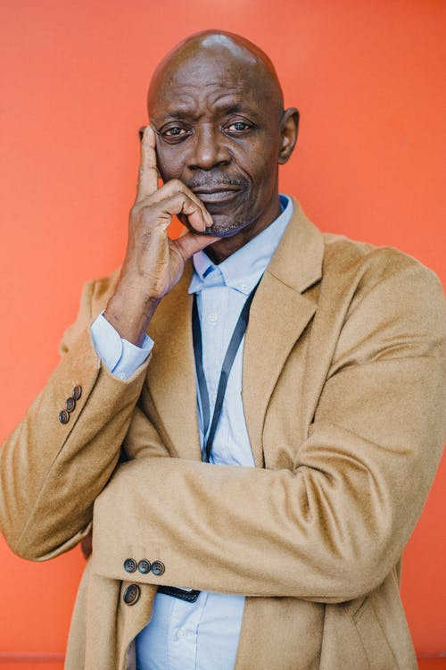

## 1. Introdução

Uma persona é um personagem fictício, que representam um grupo de usuários reais, criada para descrever um usuário típico. É utilizada principalmente para representar um grupo de usuários finais durante discussões de design, mantendo todos focados no mesmo alvo. 

Uma persona, deve possuir os seguintes elementos característicos:

- **Identidade:** a persona deve possuir nome e sobrenome, idade, escolaridade, profissão, foto, e outros dados que informam que é a persona, no intuito de de deixá-la mais realista.

- **Status:**  define se esta persona é primária, secundária, stakeholder representa um antiusuário do seu sistema. Sendo que um antiusuário e alguém que não vai utilizar o produto e, portanto, não deve influenciar as decisões de projeto.
- **Objetivos:** define quais são os objetivos desta persona.
- **Habilidades:** define quais são as habilidades da persona, como por exemplo, competências específicas.
- **Relacionamentos:** define com quem ou que tipo de relacionamento a persona possui.
- **Requisitos:**  define do que a persona precisa.
- **Tarefas:** define quais as tarefas básicas ou críticas que a persona realiza.
- **Expectativas:** define o que a persona precisa no produto e/ou como a persona acredita que o produto funcione.

As personas foram criadas no intuito de utilizá-las na técnica de Introspecção para a elicitação de requisitos.

## 2. Personas

### 2.1 Persona 1

| Persona | Camila dos Santos Luz|
|--|--|
| Status: | Stakeholder|
| Foto: |  |
| Idade: | 27 anos.|
| Profissão: | Palestrante sobre empreendimentos.|
| Escolaridade: | Superior completo.|
| Objetivos: | Ajudar e incentivar o maior número possível de pessoas a abrirem e conduzirem seu próprio negócio.|
| Habilidades: | Facilidade em motivar e se comunicar com pessoas, grande investidora no mercado financeiro, determinada em tudo que se propõe a fazer.|
| Relacionamentos: | Solteira.|
| Requisitos: | Necessita de encontrar pelo menos duas pessoas promissoras a cada palestra que realiza.|
| Tarefas: | Durante a manhã realiza palestra em empresas por todo Brasil, no período da tarde cuida de seus negócios de maneira virtual.|
| Expectativas: | Utilizar o aplicativo como documento de identificação oficial nos aeroportos, como principal objetivo. Utilizar também, nos dias das eleições, poder justificar sua ausência, de maneira online.|

<figcaption style="display: flex; flex-flow: row wrap; justify-content: center; margin-top: 0px">Tabela 1 - Persona Camila</figcaption>

### 2.2 Persona 2

| Persona | Milton de Souza Oliveira|
|--|--|
| Status: | Persona primária|
| Foto: |  |
| Idade: | 68 anos.|
| Profissão: | Comerciante.|
| Escolaridade: | Nível médio incompleto.|
| Objetivos: | Fazer do seu país um ambiente econômico mais acolhedor, deseja eleger alguém que possa reestruturar a economia e deixar seu negócio para seus filhos em um ambiente mais próspero e menos complexo.|
| Habilidades: | Apesar de possuir baixo nível educacional, é um exímio operador de caixa e administrador financeiro, bastante organizado, se relaciona bem com pessoas, trabalha de forma eficiente com papel, e tem conhecimentos em construção civil.|
| Relacionamentos: | Casado há 35 anos.|
| Requisitos: | Precisa de coisas eficientes e que não ocupem muito seu tempo e estresse de vida, já bastante caminhada.|
| Tarefas: | Gasta a maioria do seu dia focado em seu negócio, que leva praticamente sozinho, com seus filhos o ajudando pouco (por preferência dele mesmo). Durante a noite e finais de semana, gosta de gastar seu tempo com seus amigos, vendo notícias e esportes. Precisa cuidar do seu irmão, que está um pouco perdido na vida, e usa drogas.|
| Expectativas: | Apenas deseja que o produto o auxilie de forma rápida e seja fácil de utilizar, para que não tenha problemas na eleição. Gostaria que pudesse ver não só o lugar onde vota, mas também do seu irmão, que ele sempre ajuda nesse tipo de coisa séria da vida.|

<figcaption style="display: flex; flex-flow: row wrap; justify-content: center; margin-top: 0px">Tabela 2 - Persona Milton</figcaption>

### 2.3 Persona 3

| Persona | Felipe Albuquerque Pereira Junior|
|--|--|
| Status | Persona primária|
| Foto: |  |
| Idade: | 41 anos.|
| Profissão: | Fotógrafo.|
| Escolaridade: | Curso Superior Completo.|
| Objetivos: | Se tornar um dos maiores fotógrafos de moda do mundo, cuidar de suas 4 filhas pequenas, conhecer diversos países pelo seu trabalho e cada vez mais se aprofundar na fé católica.|
| Habilidades: | É um excelente fotógrafo. Organizado e com bastantes virtudes, sua comunicação com as modelos e sua habilidade em conversar com agentes da moda o faz estar em diversos países todos os meses. Apesar de não ser muito bom, é um esforçado jogador de basquete e damas.|
| Relacionamentos: | Viúvo desde 2019.|
| Requisitos: | Precisa que seu tempo seja totalmente bem aproveitado. Por estar viajando tanto e não poder ver frequentemente suas filhas, que são criadas pela tia, não pode perder tempo com coisas desnecessárias.|
| Tarefas: | Ocupa todo o seu dia procurando novas formas de alcançar o seu objetivo de ser um exímio fotógrafo. Trabalha de 12 a 14 horas por dia para sustentar suas filhas. A cada duas semanas, vai a São Paulo visitá-las na casa de sua irmã. Aos finais de semana, busca relaxar, escutar boas músicas, assistir filmes e participar da missa.|
| Expectativas: | Deseja que o produto possa disponibilizar a opção de justificar sua ausência em eleições, já que muitas vezes ele não estará disponível na sua região eleitoral para exercer seu direito. Isso o agrada já que sua esperança não está no governo.|

<figcaption style="display: flex; flex-flow: row wrap; justify-content: center; margin-top: 0px">Tabela 3 - Persona Felipe</figcaption>

### 2.4 Persona 4

| Persona | Samantha Anjos Ferreira|
|--|--|
| Status | Persona primária|
| Foto: |  |
| Idade: | 28 anos.|
| Profissão: | Estudante de Direito.|
| Escolaridade: | Curso Superior Incompleto.|
| Objetivos: | Ser um dia uma pessoa bem sucedida no meio da advocacia, principalmente quanto à área de Direito Constitucional.|
| Habilidades: | Possui um entendimento político acima do comum, é ótima jogadora de Fifa e doceira. Já experimentou ter um blog de política, mas a sua falta de tempo não a deixou.|
| Relacionamentos: | Namorando.|
| Requisitos: | Quer atuar mais no seu direito de cidadã relativo a ajudar nos processos legais que guiam seu país.|
| Tarefas: | Estuda durante metade do seu dia em sua universidade, e na outra metade, realiza estágio no Superior Tribunal de Justiça. Em algumas horas vagas, gosta de sair com suas amigas e com seu namorado. Nas madrugadas, joga Fifa Ultimate Team.|
| Expectativas: | Como ela tem muita vontade de atuar na área de Direito, gostaria muito de adquirir experiência com mesária, assim, espera que o aplicativo aborde essa função, auxiliando no processo de voluntariado durante as eleições.|

<figcaption style="display: flex; flex-flow: row wrap; justify-content: center; margin-top: 0px">Tabela 4 - Persona Samantha</figcaption>

### 2.5 Persona 5

| Persona | Isabela Moreira|
|--|--|
| Status | Antiusuário|
| Foto: |  |
| Idade: | 16 anos|
| Profissão: | Estudante.|
| Escolaridade: | Nível médio incompleto.|
| Objetivos: | Assistir a todas as séries e filmes que suas amigas recomendam, fazer todas as tarefas que sua mãe pede para conseguir juntar um bom dinheiro de mesada e conseguir comprar um iPhone de última geração. Talvez passar numa universidade, se não for algo muito difícil.|
| Habilidades: | Raciocínio muito rápido, tem habilidade com computadores e celulares para realizar todas as suas tarefas do dia a dia. Desenhista e musicista iniciante.|
| Relacionamentos: | Solteira, mas quase namorando, de forma não séria, com um colega de sua turma.|
| Requisitos: | Gosta de aplicações que sejam bonitas e despertem sua aprovação artística, não se importando muito com a funcionalidade.|
| Tarefas: | Gasta a maior parte do seu dia conversando com suas amigas na escola. Depois, assiste a seus filmes e séries. |
| Expectativas: | Espera que o aplicativo seja útil quando a mãe dela mandar usar, caso venha a perder o seu título de eleitor.|

<figcaption style="display: flex; flex-flow: row wrap; justify-content: center; margin-top: 0px">Tabela 5 - Persona Isabela</figcaption>

### 2.6 Persona 6

| Persona | Ademir Barbosa|
|--|--|
| Status | Antiusuário|
| Foto: |  |
| Idade: | 81 anos|
| Profissão: | Aposentado.|
| Escolaridade: | Nível médio completo.|
| Objetivos: | Deseja viver o resto de sua vida com sua família e se divertir com seus netos.|
| Habilidades: | Bom cozinheiro e escritor, também é um grande leitor de notícias e livros, ótimo pescador.|
| Relacionamentos: | Casado há 62 anos.|
| Requisitos: | Gosta de ter detalhes de tudo que está ao seu alcance. Seu Ademir não é uma pessoa superficial, gosta de entender e ver tudo.|
| Tarefas: | Gasta a maior parte do seu dia sem fazer muita coisa. Cozinha, lê e conversa com sua esposa. Às vezes seus filhos o buscam para ir à sua casa.|
| Expectativas: | É um eleitor com prazer, mas não gosta de usar esses aplicativos de documentos. Seu negócio é papel, não tem interesse. Seu filho instalou no seu celular para caso precise, mas o seu Ademir nem consegue enxergar o que está escrito nos botões.|

<figcaption style="display: flex; flex-flow: row wrap; justify-content: center; margin-top: 0px">Tabela 6 - Persona Ademir</figcaption>

As imagens das personas foram tiradas do site <a href="https://www.pexels.com/pt-br/" target="_blank">Pexels</a>, na qual todas a fotos podem ser usadas de forma gratuita e a citação de créditos não é obrigatória, como pode ser visto no <a href="https://www.pexels.com/pt-br/licenca/" target="_blank">link</a>.

## Referências e Bibliografias

>Barbosa, S. D. J.; Silva, B. S. da; Silveira, M. S.; Gasparini, I.; Darin, T.; Barbosa, G. D. J. (2021) Interação Humano-Computador e Experiência do usuário. Autopublicação.

## Versionamento
| Versão | Data | Modificação | Autor |
|--|--|--|--|
| 1.0 | 10/03/2021 | Criação das personas | Gabriel, Guilherme e João Pedro |
| 2.0 | 30/04/2021 | Adição de legenda às tabelas | Guilherme |
| 2.1 | 30/04/2021 | Enumeração dos tópicos e centralização das tabelas | Gabriel e Ítalo |