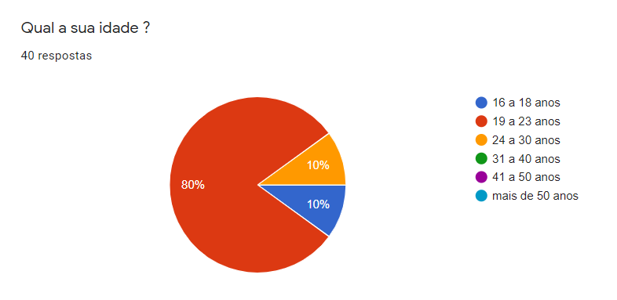
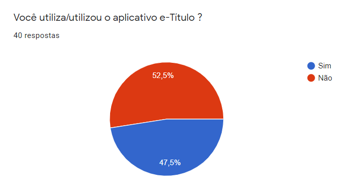
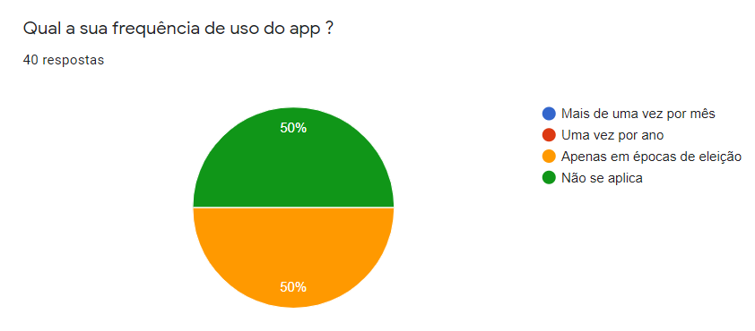
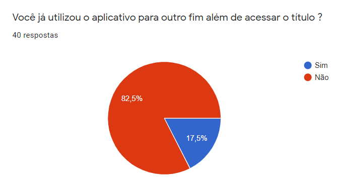
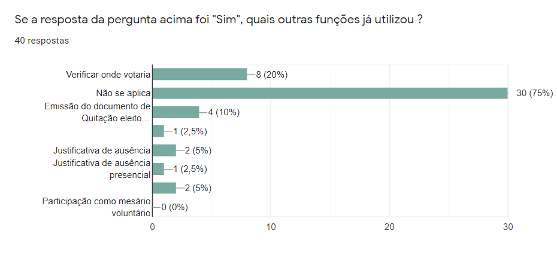
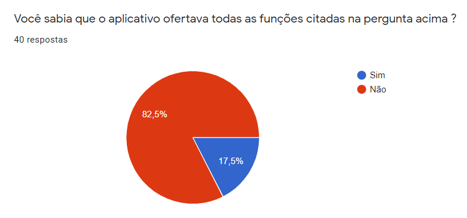
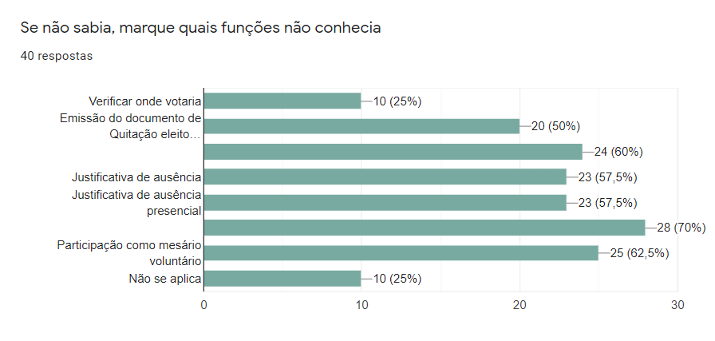
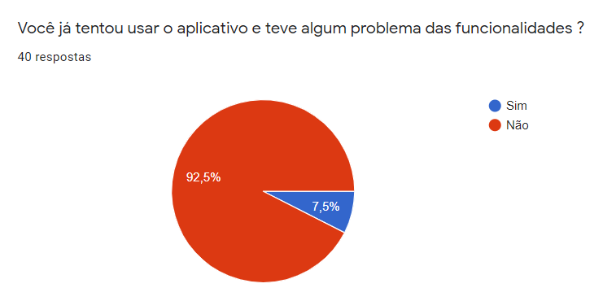
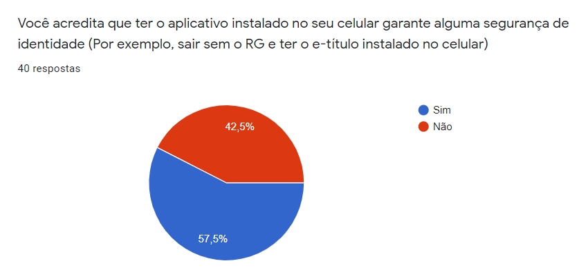

## 1. Introdução

Por facilidade, utilizamos a técnica de questionário para ajudar-nos em relação à elicitação de requisitos, ela facilitou bastante a criar uma pesquisa com participação pública em relação ao aplicativo e-Título, fizemos perguntas simples para que o possível usuário possa entender quais funcionalidades o aplicativo tem e também saber como elas funcionam.

Creio que as respostas nos abriram os olhos para entender que muitos usuários não utilizam o aplicativo ou só utilizam para acessar o título, porêm não têm conhecimento nas outras funcionalidades que o aplicativo oferece

A participação do público foi essencial para a compreensão de como o aplicativo é utilizado e quando é utilizado, a partir das respostas, conseguimos elicitar requisitos, segue a seguir as perguntas que fizemos

## 2. Motivação para a escolha dessa técnica

Pensamos em fazer perguntas que nos fariam descobrir se a pessoa que está respondendo o questionário conhece e faz uso do aplicativo, nos baseamos totalmente nesta prerrogativa. Então definimos certas questões:

- O usuário usa rotineiramente o aplicativo?
- O questionário consegue identificar o público que utiliza o aplicativo?
- Como vamos identificar quais funcionalidades o público utiliza?
- As respostas nos ajudam a identificar o comportamento do aplicativo em relação ao usuário?
- O questionário será distribuído para público alvo?

## 3. Resultados
As respostas do questionário estão listadas abaixo:

### 3.1 Questão 1

<figcaption> Figura 1: Questão sobre a idade do entrevistado </figcaption>

Para elicitar requisitos ou contruir personas, muitas vezes é necessários saber qual seria o público que se identifica com o aplicativo, por se tratar de um aplicativos, percebemos que o público que estamos entrevistando é mais jovem. Isso pode ocorrer em razão da área que e foi distribuído este questionário.

### 3.2 Questão 2

<figcaption> Figura 2: Questão sobre o uso do aplicativo </figcaption>

Percebemos que o uso do aplicativo do público que respondeu não é tão grande, isto impede um pouco o nosso desenvolvimento, pois não conseguimos identificar muitos dos problemas que o usuário comete.

### 3.3 Questão 3

<figcaption> Figura 3: Questão sobre a frequência do uso </figcaption>

Percebe-se que o uso do aplicativo só se faz necessário em época de eleições, muitas das vezes, majoritariamente por que o usuário não sabe os diferentes funções que o aplicativo possui ou por que foge do modo de vida do usuário.

### 3.4 Questão 4

<figcaption> Figura 4: Questão sobre se o usuário usa o aplicativo para algo além de acessar o e-Título </figcaption>

O objetivo dessa pergunta é identificar como as funcionalidade estão dispostas no aplicativo que estamos trabalhando, a partir das respostas, percebemos que não se utilizam muitas das diversas funções que o aplicativo oferece.

### 3.5 Questão 5

<figcaption> Figura 5: Questão sobre quais funções são principalmente utilizadas </figcaption>

Muitas das respostas serviram para identificar quais são as subfuncionalidades principais do aplicativo em si. Isto faz com que tenhamos mais noção de como as funções deveriam estar dispostas.

### 3.6 Questão 6

<figcaption> Figura 6: Questão sobre o conhecimento de algumas funcionalidades escondidas no aplicativo </figcaption>

Esta questão nos ajuda no contexto de identificar se o usuário mesmo usando ou não o aplicativo sabe se ele fornece as funções que realmente fornece.    

### 3.7 Questão 7

<figcaption> Figura 7: Questão sobre o conhecimento das funcionalidades</figcaption>

O resultado desta pergunta confirma a inferência da pergunta anterior, ou seja, nosso público não conhece as subfuncionalidades do aplicativo e-Título.

### 3.8 Questão 8

<figcaption> Figura 8: Questão sobre a verificação de problemas nas funcionalidades </figcaption>

Esta pergunta faz com que tirássemos duas conclusões, o aplicativo em si é muito eficiente e ajuda o usuário de maneira eficaz ou ninguém sabe das funções ou nunca utilizou o aplicativo. Em decorrência das respotas anteriores, não podemos mapear os erros, pois confirmamos as últimas duas conclusões.

### 3.9 Questão 9

<figcaption> Figura 9: Questão sobre a segurança de identidade do aplicativo </figcaption>

Esta pergunta serve pra confirmar alguns dados de segurança que tínhamos dúvidas na hora da introspecção, o resultado confirma algumas das nossas dúvidas, percebemos que a garantia de segurança da identidade no aplicativo não é totalmente confiante para os usuários. 

## 4. Requisitos elicitados

|Número | Requisito | Tipo |
|:--:|:--:|:--:|
| 1 | Descrever funcionalidades principais na tela inicial | Funcional |
| 2 | Oferecer tutorial no primeiro uso do aplicativo | Funcional |
| 3 | Certificação do possuidor do título de eleitor | Funcional |
| 4 | Poder justificar ausência de maneira presencial | Funcional |
| 5 | Ver o local de votação | Funcional |
| 6 | Apresentar as funcionalidades de uma forma mais visual | Não funcional |
| 7 | Demonstrar como as funcionalidades acontecem | Não funcional |
| 8 | Aumentar a acessibilidade para usuários com dificuldades | Não funcional|

<figcaption>Tabela 1 - Requisitos elicitados</figcaption>

## Referências e Bibliografias

>WIEGERS, Karl; BEATTY, Joy. "Software Requirements". Microsoft Press, 2013.

## Versionamento
| Versão | Data | Modificação | Autor |
|--|--|--|--|
| 1.0 | 10/03/2021 | Criação do documento, listagem das respostas e elicitação dos requisitos | Ítalo Vinícius |
| 1.0.1 | 18/03/2021 | Revisão gramatical | Ítalo |
| 2.1 | 30/04/2021 | Enumeração dos tópicos e inserção de legendas na tabela | Gabriel |
| 2.2 | 30/04/2021 | Adição da descrição das questões e suas respectivas legendas | Ítalo |