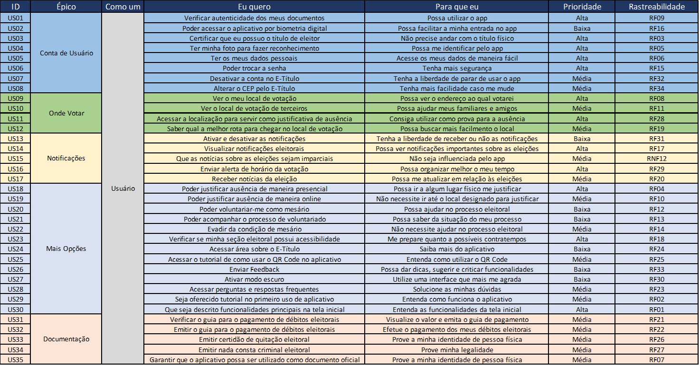

## Introdução

<p style="text-indent: 20px; text-align: justify">
O Backlog do Produto é a lista de desejos dos usuário, departamento ou personas, sendo que ele tem por objetivo apresentar de maneira transparente a todos os interessados a visão do que vem a ser ou ou do que se tornará aquele Produto em construção, além disto, tem o grande propósito de apoiar o Product Owner e a Equipe de Desenvolvimento quanto à disponibilidade dos itens e visualização da prioridade das demandas a serem construídas.
</p>
<p style="text-indent: 20px; text-align: justify">
Na construção do Backlog do Produto, criamos o Backlog, que expressa em forma de uma planilha no Excel, a lista de desejos dos usuários, e as Histórias de Usuário, que representa um aspecto muito importante no Backlog do Produto, pois por meio delas é possível apoiar e transmitir a necessidade do usuário utilizando uma linguagem simples e clara, facilitando o entendimento no desenvolvimento do Produto com base nas especificações que são criadas nesse processo.
</p>

## Backlog

O nosso Backlog possui as seguintes características:

- <div style="text-align: justify"><b>ID:</b>Identificador único para cada item do seu Backlog, auxiliando na rastreabilidade de cada item e evitando redundâncias.</div>
- <div style="text-align: justify"><b>Épico:</b>Representa uma coleção de itens no Backlog, sendo que representa também uma coleção de Histórias de Usuário, que foi construída por meio da cada item dentro do Backlog</div>
- <div style="text-align: justify"><b>Tipo de usuário:</b>Detalha o tipo de usuário. No nosso contexto o "Tipo de usuário" é expresso pela coluna "Como um", e o valor de coluna é "Usuário", que representaria para todos os itens do Backlog, um usuário padrão</div>
- <div style="text-align: justify"><b>Desejo:</b>Título e/ou descrição breve dos itens, de modo que possam ser lidos rapidamente. No nosso contexto o "Desejo" é expresso pela coluna "Eu quero"</div>
- <div style="text-align: justify"><b>Finalidade:</b>Detalha qual é a finalidade de cada desejo. No nosso contexto o "Finalidade" é expresso pela coluna "Para que eu"</div>
- <div style="text-align: justify"><b>Prioridade:</b>Informa qual é o valor de negócio de cada item no Backlog</div>
- <div style="text-align: justify"><b>Rastreabilidade:</b>Relaciona cada item com o requisito elicitado</div>

<div style="display: flex; justify-content: center">
  
</div>

<p>
<a href="https://1drv.ms/x/s!AtGes_O6JATWywXHpfMyw_s7eyet?e=yyYrAc" target="_blank">Link</a> para a planilha no Excel.
</p>

## Histórias de Usuário

<p style="text-indent: 20px; text-align: justify">
Uma história é a representação clara e informal que expressa a necessidade e/ou requisito de um potencial usuário. O objetivo da História é expressar, em poucas palavras, as dores e necessidades, propor critérios mínimos para aceitação e o valor de negócio agregado de uma forma clara, limpa e leve.
</p>

As nossas Histórias de Usuário possuem as seguintes características:

- <div style="text-align: justify"><b>Descrição:</b> Apresenta o tipo de usuário, necessidade/dor e objetivo/propósito da necessidade. </div>

A descrição seguirá a seguinte estrutura:
```
Eu, como um [backlog-como_um], quero [backlog-eu_quero] para que eu 
[backlog-para_que_eu].
```

- <div style="text-align: justify"><b>Critérios de aceitação:</b> Representam as condições mínimas necessárias para que a história possa ser considerada entregue após a construção do Produto. Os critérios de aceitação descrevem as informações necessárias para o funcionamento do Produto com base na "Descrição".</div>


### Épico 1 - Conta de Usuário

#### US01 - Verificar autenticidade dos documentos

<div style="text-align: justify">
Eu, como <b>usuário</b>, quero <b>verificar autenticidade dos meus documentos</b> para que eu <b>possa utilizar o app</b>.
</div>

Critérios de aceitação:

- <div style="text-align: justify">Deve conter um botão de verificação de documentos para entrar no aplicativo</div>
- <div style="text-align: justify">Deve acontecer uma conexão com o E-Título</div>
- <div style="text-align: justify">Deve apresentar campos para preenchimentos dos dados do usuário</div>

#### US02 - Poder acessar o aplicativo por biometria digital

<div style="text-align: justify">
Eu, como <b>usuário</b>, quero <b>poder acessar o aplicativo por biometria digital</b> para que eu <b>possa facilitar a minha entrada no aplicativo</b>.
</div>

Critérios de aceitação:

- <div style="text-align: justify">Deve acontecer uma conexão com o E-Título</div>
- <div style="text-align: justify">Deve apresentar um botão para solicitar a utilização da biometria digital</div>

#### US03 - Certificar que possuo o título de eleitor

<div style="text-align: justify">
Eu, como <b>usuário</b>, quero <b>certificar que eu possuo o título de eleitor</b> para que eu <b>não precise andar com o título físico</b>.
</div>

Critérios de aceitação:

- <div style="text-align: justify">Deve acontecer uma conexão com o E-Título</div>
- <div style="text-align: justify">Deve apresentar área para preenchimento da senha e CPF do usuário, ou botão para solicitar a utilização da biometria digital</div>

#### US04 - Ter foto para fazer reconhecimento

<div style="text-align: justify">
Eu, como <b>usuário</b>, quero <b>ter minha foto para fazer reconhecimento</b> para que eu <b>possa me identificar pelo aplicativo</b>.
</div>

Critérios de aceitação:

- <div style="text-align: justify">Deve acontecer uma conexão entre o banco de dados da Justiça Eleitoral e o E-Título</div>

#### US05 - Ter os dados pessoais

<div style="text-align: justify">
Eu, como <b>usuário</b>, quero <b>ter os meus dados pessoais</b> para que eu <b>acesse os meus dados de maneira fácil</b>.
</div>

Critérios de aceitação:

- <div style="text-align: justify">Deve conter uma página com todas as informações pessoais do usuário</div>

#### US06 - Poder trocar a senha

<div style="text-align: justify">
Eu, como <b>usuário</b>, quero <b>poder trocar a senha</b> para que eu <b>tenha mais segurança</b>.
</div>

Critérios de aceitação:

- <div style="text-align: justify">Deve conter um botão "Trocar senha" na sessão de "Mais Opções"</div>
- <div style="text-align: justify">Deve conter uma página pedindo a senha antiga e um campo de senha nova</div>
- <div style="text-align: justify">Deve salvar a nova senha válida do usuário</div>

#### US07 - Desativar a conta no E-Título

<div style="text-align: justify">
Eu, como <b>usuário</b>, quero <b>desativar a conta no E-Título</b> para que eu <b>tenha a liberdade de parar de usar o aplicativo</b>.
</div>

Critérios de aceitação:

- <div style="text-align: justify">Deve conter um botão para desativar a conta</div>

#### US08 - Alterar o CEP pelo E-Título

<div style="text-align: justify">
Eu, como <b>usuário</b>, quero <b>alterar o CEP pelo E-Título</b> para que eu <b>tenha mais facilidade caso me mude</b>.
</div>

Critérios de aceitação:

- <div style="text-align: justify">Deve conter um botão "Alterar CEP" na sessão de "Mais Opções"</div>
- <div style="text-align: justify">Deve conter uma página pedindo o CEP antigo e um campo de CEP novo</div>
- <div style="text-align: justify">Deve salvar o novo CEP válido do usuário</div>


### Épico 2 - Onde Votar

#### US09 - Ver o local de votação

<div style="text-align: justify">
Eu, como <b>usuário</b>, quero <b>ver o meu local de votação</b> para que eu <b>possa ver o endereço ao qual votarei</b>.
</div>

Critérios de aceitação:

- <div style="text-align: justify">Deve conter um ícone "Onde votar" na tela inicial para se verificar o local de votação</div>
- <div style="text-align: justify">Deve conter conexão com o E-Título e uma ferramenta de localização</div>

#### US10 - Ver o local de votação de terceiros

<div style="text-align: justify">
Eu, como <b>usuário</b>, quero <b>ver o local de votação de terceiros para</b> que eu <b>possa ajudar meus familiares e amigos</b>.
</div>

Critérios de aceitação:

- <div style="text-align: justify">Deve conter um botão "Local de votação de terceiros" para se verificar o local de votação de outras pessoas</div>
- <div style="text-align: justify">Deve conter uma página para preencher os campos de "Tipo de Documento", "Data de Nascimento" e "Nome da Mãe", caso conste no documento do terceiro</div>
- <div style="text-align: justify">Deve conter um botão "Consultar" para efetuar a pesquisa</div>

#### US11 - Acessar a localização para servir como justificativa de ausência

<div style="text-align: justify">
Eu, como <b>usuário</b>, quero <b>acessar a localização para servir como justificativa de ausência</b> para que eu <b>consiga utilizar como prova para a ausência</b>.
</div>

Critérios de aceitação:

- <div style="text-align: justify">Deve conter um botão "Justificativa de Ausência" para acessar localização e justificar ausência</div>
- <div style="text-align: justify">Deve conter uma página para preencher os campos de "Eleição que deseja justificar", "Justificativa para ausência" e "Qual seu e-mail?", para se poder dar as informações necessárias</div>

#### US12 - Saber qual a melhor rota para chegar no local de votação

<div style="text-align: justify">
Eu, como <b>usuário</b>, quero <b>saber qual a melhor rota para chegar no local de votação</b> para que eu <b>possa buscar mais facilmente o local</b>.
</div>

Critérios de aceitação:

- <div style="text-align: justify">Deve conter conexão com o E-Título e uma ferramenta de localização</div>
- <div style="text-align: justify">Deve conter um ícone "Onde votar" na tela inicial para se verificar o local de votação</div>
- <div style="text-align: justify">Deve conter um botão "Ver Rotas" na tela inicial para ser direcionado ao aplicativo de localização a ser utilizado</div>

### Épico 3 - Notificações

#### US13 - Ativar e desativar as notificações

<div style="text-align: justify">
Eu, como um <b>usuário</b>, quero <b>ativar e desativar as notificações</b> para que eu <b>tenha a liberdade de receber ou não as notificações</b>.
</div>

Critérios de aceitação:

- <div style="text-align: justify">Deve conter no próprio aplicativo um botão que ative e desative as notificações</div>
- <div style="text-align: justify">Deve conter no próprio aplicativo um botão que ative e desative as notícias</div>

<div style="text-align: justify">
<b>OBS.:</b> Estaremos abordando "notificações" como informações importantes que são específicas para o usuário, e "notícias", como informações gerais que são mandadas para todos os usuários.
</div>

#### US14 - Visualizar notificações eleitorais

<div style="text-align: justify">
Eu, como um <b>usuário</b>, quero <b>visualizar notificações eleitorais</b> para que eu <b>possa ver notificações importantes sobre as eleições</b>.
</div>

Critérios de aceitação:

- <div style="text-align: justify">Deve conter um local específico para visualizar as notificações</div>
- <div style="text-align: justify">Deve conter um botão para que a notificação possa ser apagada</div>
- <div style="text-align: justify">Deve conter um botão para que a possa salvar um notificação importante</div>
- <div style="text-align: justify">A notificação deve sumir depois de um tempo</div>
- <div style="text-align: justify">Notificações novas devem aparecer na parte superior a todas as outras notificações</div>

#### US15 - Que as notícias sobre as eleições sejam imparciais

<div style="text-align: justify">
Eu, como um <b>usuário</b>, quero <b>que as notícias sobre as eleições sejam imparciais</b> para que eu <b>não seja influenciada pelo app</b>.
</div>

Critérios de aceitação:

- <div style="text-align: justify">As notificações devem ser filtradas, para que não chegue ao usuário notícias falsas, desnecessárias ou que tendencie algum candidato espécifico</div>

#### US16 - Enviar alerta de horário da votação

<div style="text-align: justify">
Eu, como um <b>usuário</b>, quero <b>enviar alerta de horário da votação</b> para que eu <b>possa organizar melhor o meu tempo</b>.
</div>

Critérios de aceitação:

- <div style="text-align: justify">Notificações importantes como o alerta de horário da votação devem ser mostradas como notificações do sistema, ou seja, mostradas mesmas com o aplicativo fechado</div>

#### US17 - Receber notícias da eleição

<div style="text-align: justify">
Eu, como um <b>usuário</b>, quero <b>receber notícias da eleição</b> para que eu <b>possa me atualizar em relação às eleições</b>.
</div>

Critérios de aceitação:

- <div style="text-align: justify">Deve conter uma marcação que diferencie as notícias das notificações importantes, que são específicas para o usuário</div>
- <div style="text-align: justify">As notícias não devem aparecer como notificações do sistema, ou seja, o usuário deve visualizá-las apenas dentro do aplicativo</div>

### Épico 4 - Mais Opções

#### US18 - Justificar ausência de maneira presencial

<div style="text-align: justify">
Eu, como um <b>usuário</b>, quero <b>poder justificar ausência de maneira presencial</b> para que eu <b>possa ir a algum lugar físico me justificar</b>.
</div>

Critérios de aceitação:

- <div style="text-align: justify">Deve conter opções de UF a serem selecionados</div>
- <div style="text-align: justify">Deve conter opções de Municípios a serem selecionados</div>

#### US19 - Justificar ausência de maneira online

<div style="text-align: justify">
Eu, como um <b>usuário</b>, quero <b>poder justificar ausência de maneira online</b> para que eu <b>não necessite ir até o local designado para justificar</b>.
</div>

Critérios de aceitação:

- <div style="text-align: justify">Deve conter opções de eleições que deseja justificar</div>
- <div style="text-align: justify">Deve apresentar área para descrição da justificativa de ausência</div>
- <div style="text-align: justify">Deve apresentar área para preenchimento do e-mail</div>
- <div style="text-align: justify">Deve conter um botão para passar a próxima página</div>
- <div style="text-align: justify">Deve conter um botão para voltar a página anterior</div>
- <div style="text-align: justify">Deve conter um botão para concluir processo</div>
- <div style="text-align: justify">Deve conter um botão para anexar documento comprobatório da ausência</div>

#### US20 - Voluntariar-me como mesário

<div style="text-align: justify">
Eu, como um <b>usuário</b>, quero <b>poder voluntariar-me como mesário</b> para que eu <b>possa ajudar no processo eleitoral</b>.
</div>

Critérios de aceitação:

- <div style="text-align: justify">Deve conter um botão para confirmar inscrição como mesário</div>
- <div style="text-align: justify">Deve conter o link de acesso ao site com mais informações sobre mesário</div>

#### US21 - Acompanhar o processo de voluntariado

<div style="text-align: justify">
Eu, como um <b>usuário</b>, quero <b>poder acompanhar o processo de voluntariado</b> para que eu <b>possa saber da situação do meu processo</b>.
</div>

Critérios de aceitação:

- Nenhum critério identificado

#### US22 - Evadir da condição de mesário

<div style="text-align: justify">
Eu, como um <b>usuário</b>, quero <b>poder evadir da condição de mesário</b> para que eu <b>não necessite ajudar no processo eleitoral</b>.
</div>

Critérios de aceitação:

- Nenhum critério identificado

#### US23 - Verificar se a seção eleitoral possui acessibilidade

<div style="text-align: justify">
Eu, como um <b>usuário</b>, quero <b>verificar se minha seção eleitoral possui acessibilidade</b> para que eu <b>me prepare quanto a possíveis contratempos</b>.
</div>

Critérios de aceitação:

- <div style="text-align: justify">Deve conter botão informativo sobre presença de adaptações de acessibilidade</div>
- <div style="text-align: justify">Deve conter botão de confirmação do entendimento do conteúdo apresentado</div>

#### US24 - Acessar área sobre o E-Título

<div style="text-align: justify">
Eu, como um <b>usuário</b>, quero <b>acessar área sobre o E-Título</b> para que eu <b>saiba mais do aplicativo</b>.
</div>

Critérios de aceitação:

- <div style="text-align: justify">Deve conter link de acesso ao site do TSE com informações sobre o aplicativo</div>

#### US25 - Acessar o tutorial de como usar o QR Code no aplicativo

<div style="text-align: justify">
Eu, como um <b>usuário</b>, quero <b>acessar o tutorial de como usar o QR code no aplicativo</b> para que eu <b>entenda como utilizar o QR code</b>.
</div>

Critérios de aceitação:

- <div style="text-align: justify">Deve conter botão de confirmação do entendimento do conteúdo apresentado</div>

#### US26 - Enviar Feedback

<div style="text-align: justify">
Eu, como um <b>usuário</b>, quero <b>enviar feedback</b> para que eu <b>possa dar dicas, sugerir e criticar funcionalidades</b>.
</div>

Critérios de aceitação:

- <div style="text-align: justify">Deve conter área para escrita do feedback</div>
- <div style="text-align: justify">Deve conter botão de confirmação de envio</div>

#### US27 - Ativar modo escuro

<div style="text-align: justify">
Eu, como um <b>usuário</b>, quero <b>ativar modo escuro</b> para que eu <b>utilize uma interface que mais me agrada</b>.
</div>

Critérios de aceitação:

- <div style="text-align: justify">Deve conter botão de ativação do modo escuro</div>

#### US28 - Acessar perguntas e respostas frequentes

<div style="text-align: justify">
Eu, como um <b>usuário</b>, quero <b>acessar perguntas e respostas frequentes</b> para que eu <b>solucione as minhas dúvidas</b>.
</div>

Critérios de aceitação:

- <div style="text-align: justify">Deve conter botão de acesso as respostas para cada pergunta</div>

#### US29 - Oferecer tutorial no primeiro uso de aplicativo

<div style="text-align: justify">
Eu, como um <b>usuário</b>, quero <b>seja oferecido tutorial no primeiro uso do aplicativo</b> para que eu <b>entenda como funciona o aplicativo</b>.
</div>

Critérios de aceitação:

- <div style="text-align: justify">Deve conter botão de confirmação do entendimento do conteúdo apresentado</div>

#### US30 - Descrever funcionalidades principais na tela inicial

<div style="text-align: justify">
Eu, como um <b>usuário</b>, quero <b>que seja descrito funcionalidades principais na tela inicial</b> para que eu <b>entenda as funcionalidades da tela inicial</b>.
</div>

Critérios de aceitação:

- <div style="text-align: justify">Deve conter um botão para passar página de descrição das funcionalidades</div>
- <div style="text-align: justify">Deve conter um botão para voltar página de descrição das funcionalidades</div>
- <div style="text-align: justify">Deve conter um botão para finalizar a descrição das funcionalidades</div>
- <div style="text-align: justify">Deve conter um botão para pular descrição das funcionalidades</div>


### Épico 5 - Documentação

#### US31 - Verificar o guia para o pagamento de débitos eleitorais

<div style="text-align: justify">
Eu, como um <b>usuário</b>, quero <b>verificar o guia para o pagamento de débitos eleitorais</b> para que eu <b>visualize o valor e emita o guia de pagamento</b>.
</div>

Critérios de aceitação:

- <div style="text-align: justify">Deve conter um local específico para visualizar o guia de débitos eleitorais</div>

#### US32 - Emitir o guia para o pagamento de débitos eleitorais

<div style="text-align: justify">
Eu, como um <b>usuário</b>, quero <b>emitir o guia para o pagamento de débitos eleitorais</b> para que eu <b>efetue o pagamento dos meus débitos eleitorais</b>.
</div>

Critérios de aceitação:

- <div style="text-align: justify">Deve conter os dados necessários para que ao emitir o guia de débitos eleitorais, seja possível fazer o pagamento via celular, sem a necessidade de imprimir o guia</div>

#### US33 - Emitir certidão de quitação eleitoral

<div style="text-align: justify">
Eu, como um <b>usuário</b>, quero <b>emitir certidão de quitação eleitoral</b> para que eu <b>prove a minha identidade de pessoa física</b>.
</div>

Critérios de aceitação:

- <div style="text-align: justify">Deve conter um local específico para visualizar a certidão de quitação eleitoral</div>

#### US34 - Emitir nada consta criminal eleitoral

<div style="text-align: justify">
Eu, como um <b>usuário</b>, quero <b>emitir nada consta criminal eleitoral</b> para que eu <b>prove minha legalidade</b>.
</div>

Critérios de aceitação:

- <div style="text-align: justify">Deve conter um local específico para visualizar o nada consta criminal eleitoral</div>

#### US35 - Garantir que o aplicativo possa ser utilizado como documento oficial

<div style="text-align: justify">
Eu, como um <b>usuário</b>, quero <b>garantir que o aplicativo possa ser utilizado como documento oficial</b> para que eu <b>prove a minha identidade de pessoa física</b>.
</div>

Critérios de aceitação:

- <div style="text-align: justify">Os dados imutáveis pelo próprio usuário, devem estar sempre devidamente atualizados</div>


## Referência
> Schwaber, Ken; Sutherland, Jeff. O Guia do Scrum, O Guia Definitivo para o Scrum: As Regras do Jogo. 2020.

> Disponível em <https://odonodoproduto.com/backlog-do-produto/>. Acesso em: 16/03/2020.

> Disponível em <https://odonodoproduto.com/user-story-historia-de-usuario/>. Acesso em: 16/03/2020.


## Versionamento
| Versão | Data | Modificação | Autor |
|--|--|--|--|
| 1.0 | 24/03/2021 | Criação do Backlog | Gabriel, Ian, João Pedro |
| 1.1 | 31/03/2021 | Criação das Histórias de usuários | Gabriel, Ian, João Pedro |