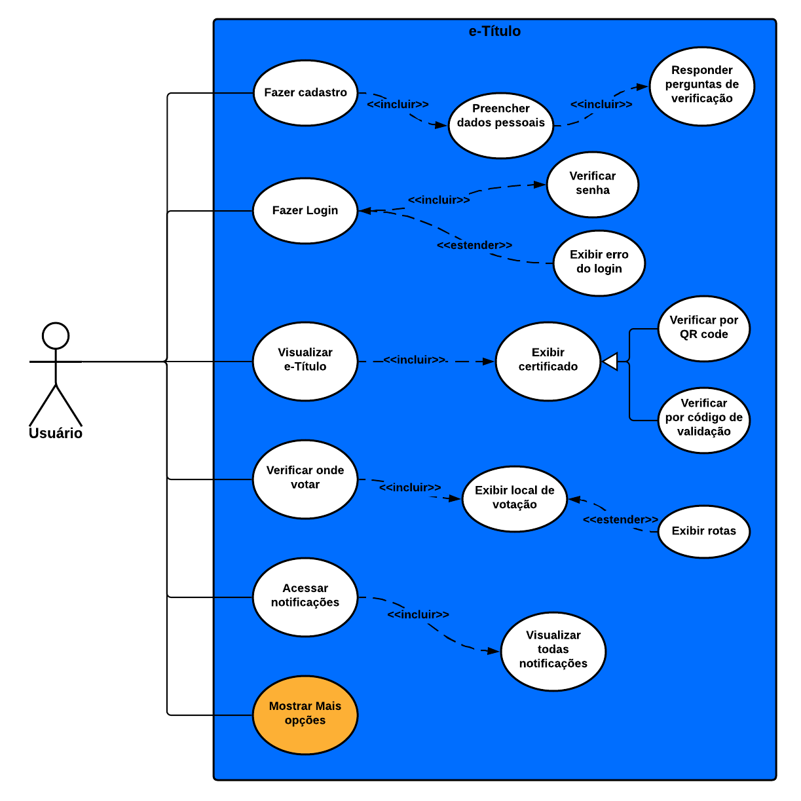
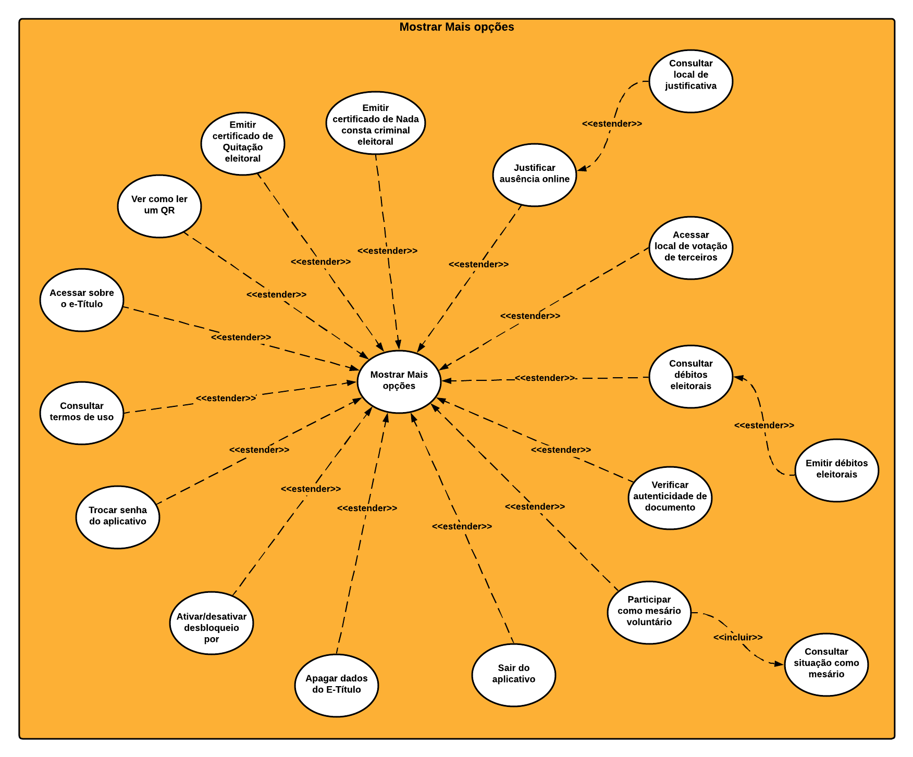

## 1. Introdução

Os casos de uso são uma técnica de descoberta de requisitos, sendo que em sua forma mais simples, um caso de uso identifica os atores envolvidos em uma interação e dá nome ao tipo de interação. Essa é, então, suplementada por informações adicionais que descrevem a interação com o sistema. A informação adicional pode ser uma descrição textual, que foi o método completar que o grupo escolheu, mas pode ser feito através de um ou mais modelos gráficos, como diagrama de sequência ou de estados da UML.

O conjunto de casos de uso representa todas as possíveis interações que serão descritas nos requisitos de sistema. Um diagrama de caso de uso possui os seguintes elementos:

- **Atores:** que podem ser pessoas ou outros sistemas, e são representados como figuras ‘palito’;
- **Classe de interação:** representa as ações dos usuários ou do sistema, e são representadas por uma elipse;
- **Relacionamentos:** fazem a ligação entre os atores e a interação;
- **Caixa de limite do sistema:** define um escopo do sistema para os casos de uso. Todos os casos de uso fora da caixa são considerados fora do escopo do sistema.

## 2. Diagramas de casos de uso

Diagramas feitos utilizando a ferramenta LucidChart.

### 2.1 Caso de uso geral

 
  
  <figcaption>Figura 1 - Caso de uso geral feito utilizando o <a href="https://lucid.app/lucidchart/invitations/accept/inv_7eb2b30a-3ddd-499d-ad42-0600cb4a80b6" target="_blank">LucidChart</a></figcaption>

### 2.2 Caso de uso específico - "Mostrar mais opções"

A imagem abaixo retrata os casos de uso específicos para a função "Mostrar mais opções" que pode ser visto na imagem acima, na elipse amarela do "Caso de uso geral".

 
  
  <figcaption>Figura 2 - Caso de uso específico da função "Mostrar mais opções" feito utilizando o <a href="https://lucid.app/lucidchart/invitations/accept/inv_7eb2b30a-3ddd-499d-ad42-0600cb4a80b6" target="_blank">LucidChart</a></figcaption>

## 3. Descrição dos casos de uso

### 3.1 Caso 1: Fazer Cadastro

| Caso 1 | Informações |
| :----: | :----------- |
| Descrição | Quando o aplicativo é acessado pela primeira vez depois da sua instalação, o ator necessita fazer um pequeno cadastro para acessar e verificar se os dados são reais |
| Ator(es) | Usuário |
| Pré-condições | Ter o aplicativo já instalado em seu dispositivo e ter acesso à internet |
| Fluxo | 1 - O ator precisa abrir o aplicativo   2 - Necessita inserir dados pessoais em um fomulário (Nome, número do CPF ou Título, nome dos pais)    3 - Precisa responder perguntas pessoais de validação   4 - Se o cadastro for efetivado, então poderá escolher uma senha para efetuar o login (Caso 2)  |
| Pós-condições | O ator poderá fazer login e ter acesso a todos os benefícios do aplicativo | 
| Rastreabilidade | Requisito Funcional:   09 (RF09) - Verificar autenticidade de documentos     Pasta: Elicitação de Requisitos -> Requisitos Elicitados |

<figcaption>Tabela 1 - Descrição do Caso de Uso 1</figcaption>

### 3.2 Caso 2: Fazer Login

| Caso 2 | Informações |
| :----: | :----------- |
| Descrição | O ator, ao iniciar o aplicativo, pode efetuar o Login para acessar o aplicativo e utilizá-lo |
| Ator(es) | Usuário |
| Pré-condições | Ter o aplicativo já instalado, ter acesso à internet e já estar cadastrado no aplicativo |
| Fluxo | 1 - O ator precisa abrir o aplicativo   2 - Necessita inserir a senha ou entrar com a biometria para acessar a conta do e-Título  |
| Pós-condições | O ator poderá ter usufruído de todas as funcionalidades do aplicativo |
| Rastreabilidade | Requisito Funcional:   16 (RF16) - Poder acessar o aplicativo por biometria/digital     Pasta: Elicitação de Requisitos -> Requisitos Elicitados |

<figcaption>Tabela 2 - Descrição do Caso de Uso 2</figcaption>

### 3.3 Caso 3: Ver e-Título

| Caso 3 | Informações |
| :----: | :----------- |
| Descrição | Ao acessar a tela inicial do app, o ator pode ver seu e-Título e informações relacionadas a este documento(Número do Titulo de eleitor e verificar se possui biometria, por exemplo) |
| Ator(es) | Usuário |
| Pré-condições | O ator deve estar logado |
| Fluxo | 1 - O ator precisa abrir o aplicativo   2 - Necessita Fazer cadastro (Caso 1) ou Login (Caso 2)   3 - Visualiza na tela inicial o seu e-Título  |
| Pós-condições | O ator poderá ter verificado todas as informações relacionadas ao seu e-Título |
| Rastreabilidade | Requisitos Funcionais:   05 (RF05) - Ter foto para fazer reconhecimento   06 (RF06) - Ter dados pessoais   07 (RF07) - Garantir que o app possa ser utilizado como documento oficial     Pasta: Elicitação de Requisitos -> Requisitos Elicitados |

<figcaption>Tabela 3 - Descrição do Caso de Uso 3</figcaption>

### 3.4 Caso 4: Verificar onde votar

| Caso 4 | Informações |
| :----: | :----------- |
| Descrição | Ao acessar a tela de onde votar, o ator pode visualizar o seu local de votação e acessar as rotas até esse local por meio de alguma aplicação externa relacionada a  localização e navegação por meio do GPS|
| Ator(es) | Usuário |
| Pré-condições | O ator deve estar logado  e ter acesso a internet |
| Fluxo | 1 - O ator precisa abrir o aplicativo   2 - Necessita Fazer cadastro (Caso 1) ou Login (Caso 2)   3 - O ator clica no ícone "Onde votar", na parte inferior  4 - O ator visualiza no mapa o local de votação e as informações sobre o local   5 - O ator pode clicar na opção "VER ROTAS", que tendo uma aplicativo externo que possibilite isso, o ator poderá ver a rotas  |
| Pós-condições | O ator poderá estar guiado ao local da votação por meio do local descrito no aplicativo |
| Rastreabilidade | Requisito Funcional:   19 (RF19) - Saber qual a melhor rota para chegar no local de votação     Pasta: Elicitação de Requisitos -> Requisitos Elicitados |

<figcaption>Tabela 4 - Descrição do Caso de Uso 4</figcaption>

### 3.5 Caso 5: Acessar notificações

| Caso 5 | Informações |
| :----: | :----------- |
| Descrição | Ao acessar a tela inicial, o ator pode verificar se ele tem novas notificações e visualizá-las clicando no ícone "Notificações"|
| Ator(es) | Usuário |
| Pré-condições | O ator deve estar logado e ter acesso a internet |
| Fluxo | 1 - O ator precisa abrir o aplicativo   2 - Necessita Fazer cadastro (Caso 1) ou Login (Caso 2)   3 - Na tela inicial, o ator clica no ícone "Notificações"   4 - O ator pode verificar se existem notificações e visualizá-las |
| Pós-condições | O ator poderá estar informado pelas notificações recebidas |
| Rastreabilidade | Requisito Funcional:   17 (RF17) - Visualizar notificações eleitorais     Pasta: Elicitação de Requisitos -> Requisitos Elicitados |

<figcaption>Tabela 5 - Descrição do Caso de Uso 5</figcaption>

### 3.6 Caso 6: Mostrar "Mais opções"

| Caso 6 | Informações |
| :----: | :----------- |
| Descrição | Ao acessar a tela inicial, o ator pode verificar todas as outras opções disponibilizadas pelo aplicativo clicando no ícone "Mais opções". Opções como: "quitação eleitoral", "justificativa presencial", entre outros... |
| Ator(es) | Usuário |
| Pré-condições | O ator deve estar logado |
| Fluxo | 1 - O ator precisa abrir o aplicativo   2 - Necessita Fazer cadastro (Caso 1) ou Login (Caso 2)   3 - Na tela inicial, o ator clica no ícone "Mais opções"   4 - O ator pode usufruir de todas as outras opções que o aplicativo oferece  |
| Pós-condições | O ator poderá ter usufruído de todas as opções descritas em "Mais opções" |
| Rastreabilidade | Requisitos Funcionais:   04 (RF04) - Poder justificar ausência de maneira presencial   08 (RF08) - Ver local de votação de outras pessoas    09 (RF09) - Verificar autenticidade de documentos   10 (RF10) - Poder justificar ausência de maneira online   12 (RF12) - Poder voluntariar-se como mesário   14 (RF14) - Evadir da condição de mesário   21 (RF21) - Verificar o guia para o pagamento de débitos eleitorais   22 (RF22) - Emitir o guia para o pagamento de débitos eleitorais   23 (RF23) - Acessar perguntas e respostas frequentes   24 (RF24) - 	Acessar a área sobre o e-Título   25 (RF25) - Acessar o tutorial de como usar o QR Code no aplicativo   26 (RF26) - Emitir certidão de quitação eleitoral   27(RF27) - Emitir nada consta criminal eleitoral   32 (RF32) - Desativar conta no e-Título     Pasta: Elicitação de Requisitos -> Requisitos Elicitados |

<figcaption>Tabela 6 - Descrição do Caso de Uso 6</figcaption>

## Referências e Bibliografias
> SOMMERVILLE, Ian. Engenharia de Software. 9.ed. São Paulo: Pearson Prentice Hall, 2011. 529 p.

## Versionamento
| Versão | Data | Modificação | Autor |
|--|--|--|--|
| 1.0 | 18/03/2021 | Identificação dos casos de uso | Todos os integrantes |
| 1.1 | 31/03/2021 | Adicionando legenda nas imagens após feedback do professor e monitores | Ian |
| 1.2 | 30/04/2021 | Adicionando o link dos diagramas e a legenda das imagens | Ian |