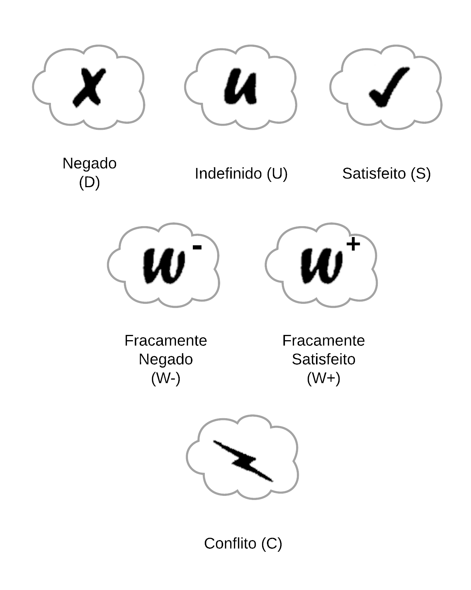
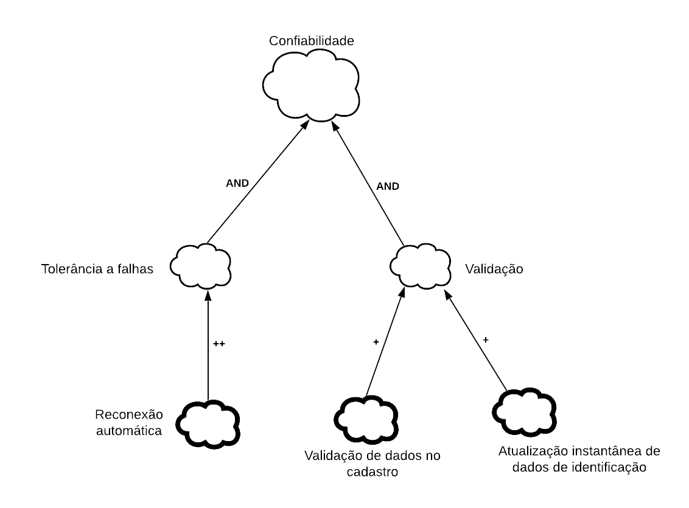
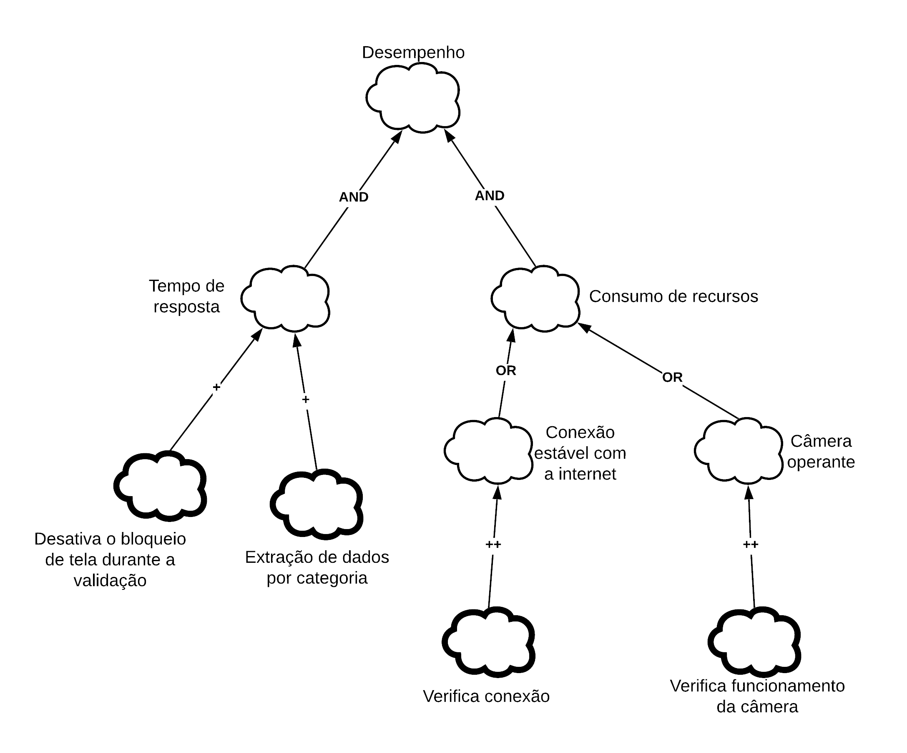
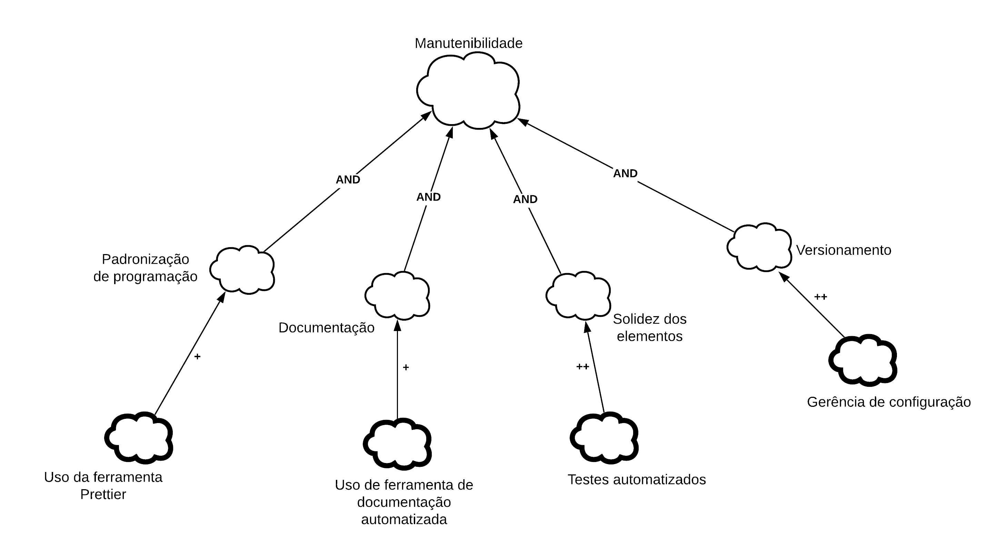

## Introdução

O NFR framework tem como objetivo mapear e representar melhor os requisitos não funcionais do projeto em questão, os quais estão listados na aba “Todos requisitos”. O NFR framework criado por (CHUNG et al., 2000), foi adotado por propor uma abordagem específica para o tratamento de Requisitos Não-Funcionais e fornecer uma rica representação para expressar esses requisitos, além de suas relações e correlações.

## Objetivo

Seu objetivo é ajudar desenvolvedores na implementação de soluções personalizadas, levando em consideração as características do domínio e do sistema em questão. Tais características incluem Requisitos Não-funcionais, Requisitos funcionais, prioridades e carga de trabalho. Esses fatores determinam a escolha de alternativas de desenvolvimento para um determinado sistema (CHUNG et al., 2000). 

Os softgoals são utilizados para representar Requisitos Não-Funcionais e podem estar inter-relacionados, expressando a influência de um softgoal em outro. O Framework também possui um método de análise qualitativa para decidir os status dos softgoals, dado que outros softgoals relacionados foram ou não satisfeitos (CHUNG et al., 2000). 

Para lidar com uma variedade de alternativas de desenvolvimento, os desenvolvedores podem consultar os catálogos de requisitos descritos na notação adotada pelo NFR Framework.  Os catálogos têm a finalidade de organizar o conhecimento sobre Requisitos Não Funcionais específicos, interdependências e trade-offs (CHUNG et al., 2000).

## Representação

### Softgoals

 
  
  <figcaption>Figura 1 - Representação geral dos softgoals</figcaption>

### Contribuição

 
  
  <figcaption>Figura 2 - Descrição textual e imagética das contribuições entre os softgoals</figcaption>

### Rótulos dos softgoals

 
  
  <figcaption>Figura 3 - Rótulos que as softgoals podem ou não ter</figcaption>

## Non-Functional requirements (NFR) Framework 

Todos o diagramas abaixo são baseados nos testes e análise de documentos da aplicação, sendo muito dos contextos inferidos por meio do uso exploratório do e-Título.

### Geral

 
  
  <figcaption>Figura 4 - Representação geral</figcaption>

### Confiabilidade

Em desenvolvimento

<!-- 
 
  
  <figcaption>Figura 5 - Representação da Confiabilidade</figcaption>

 -->

### Custo

Em desenvolvimento

<!-- 
 
  
  <figcaption>Figura 6 - Representação do Custo</figcaption>

 -->

### Desempenho

 
  
  <figcaption>Figura 7 - Representação do Desempenho</figcaption>

### Manutenibilidade

 
  
  <figcaption>Figura 8 - Representação da Manutenibilidade</figcaption>

### Segurança

 
  
  <figcaption>Figura 9 - Representação da Segurança</figcaption>

### Usabilidade

 
  
  <figcaption>Figura 10 - Representação da Usabilidade</figcaption>

## Referência

> CHUNG, L.; NIXON, B. A.; YU, E.; MYLOPOULOS, J. Non-functional requirements in software engineering. Springer Science & Business Media: [s.n.], 2000. v. 5.

> Todas as imagens foram feitas pelos próprios integrantes utilizando a ferramenta LucidChart

### Versionamento

| Versão | Data | Modificação | Autor |
|--|--|--|--|
| 1.0 | 24/03/2021 | NFR framework desenvolvido | Guilherme e Ítalo |
