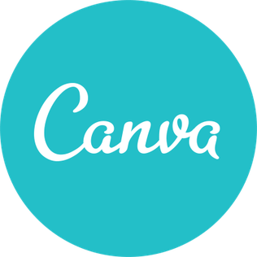

## 1. Aplicativos avaliados individualmente

- Gabriel Bonifácio Perez Nunes -  <a href="https://play.google.com/store/apps/details?id=br.gov.datasus.vivabem&hl=pt_BR&gl=US" target="_blank">Viva Bem</a>
- Guilherme de Morais Richter - <a href="https://play.google.com/store/apps/details?id=com.ingressoscomdescontos.TremdoCorcovado&hl=pt_BR&gl=US" target="_blank">Trem do Corcovado</a>
- Ian Fillipe Pontes Ferreira - <a href="https://play.google.com/store/apps/details?id=br.jus.tse.eleitoral.etitulo&hl=pt_BR&gl=US" target="_blank">e-Título</a>
- Italo Vinícius Pereira Guimarães - <a href="https://play.google.com/store/apps/details?id=br.gov.serpro.cnhe&hl=pt_BR&gl=US" target="_blank">Carteira Digital de Trânsito</a>
- João Pedro Elias de Moura - <a href="https://play.google.com/store/apps/details?id=com.tranzmate&hl=pt_BR&gl=US" target="_blank">Moovit</a>

<p style="text-indent: 20px; text-align: justify">
Em consenso, escolhemos o e-Título.
</p>

## 2. Cronograma

<p style="text-indent: 20px; text-align: justify">
A partir dos prazos estipulados pela disciplina e pela disponibilidade dos integrantes, o grupo organizou um cronograma com o intuito de realizar as tarefas propostas no projeto.
</p>

OBS.: Essas datas podem mudar futuramente.

### 2.1 Cronograma de atividades

<center>

|Título|Data|Descrição|Foi cumprido a tempo?|
|:------:|:-----------------------------:|:----------------------------------:|:----------------------------------:|
| Pré-Rastreabilidade | 15/02 - 19/02| Planejamento do projeto e RichPicture| &#10004 |
| Elicitação de Requisitos | 20/02 - 11/03  | Técnicas e Priorização| &#10004 |
| Modelagem de Requisitos | 12/03 - 21/03 | Cenários , Léxico, Use Case, Especificação Suplementar| &#10004 |
| Modelagem de Requisitos - Ágil | 22/03 - 31/03 | Histórias de Usuário, Backlogs, NFR Framework | &#10004 |
| Análise de Requisitos | 01/04 - 11/04 | Verificação e Validação | &#10004 |
| Pós-Rastreabilidade | 12/04 - 20/04 | Gerência de Desenvolvimento de Software orientada à baseline de Requisitos | &#10004 |
| Projeto final | 21/04 - 03/05 | Desenvolver a apresentação final do projeto | &#10004 |

<figcaption>Tabela 1 - Cronograma de atividades</figcaption>

</center>

### 2.2 Disponibilidade dos integrantes

<p style="text-indent: 20px; text-align: justify">
Tabela que mostra a disponibilidade de cada integrante, no intuito de o próprio grupo ter conhecimento de quando todos os participantes poderão se reunir para discutir e trabalhar no projeto. 
</p>

<div style="display: flex; flex-flow: row wrap; justify-content: center; margin: 30px auto"> 
  
  <figcaption>Figura 1 - Disponibilidade dos integrantes</figcaption>
</div>

<p style="text-indent: 20px; text-align: justify">
Além dos horários listados acima, o grupo também realizou, por necessidade emergencial, alguns trabalhos durante a quinta-feira, mesmo que estivesse fora do horário até então enumerado acima.
</p>

## 3. Metodologia adotada

### 3.1 XP - EXtreme Programming

<p style="text-indent: 20px; text-align: justify">
Pensamos em uma metodologia para se trabalhar, porém não conseguimos nos identificar com nenhuma, no entanto, a partir da lista de exercícios de Requisitos de Software sobre os métodos ágeis, escolhemos a metodologia XP, seguindo seus valores de comunicação, simplicidade, feedback, coragem e respeito. Adotamos esta metodologia para descrever o nosso processo de trabalho e desenvolvimento do projeto.
</p>

<p style="text-indent: 20px; text-align: justify">
Dentre as variáveis de controle em projetos (custo, tempo, qualidade e escopo), há um foco explícito em escopo. Para isso, recomenda-se a priorização de funcionalidades que representem maior valor possível para o negócio. Desta forma, caso seja necessário a diminuição de escopo, as funcionalidades menos valiosas serão adiadas ou canceladas.
</p>

### 3.2 Reuniões semanais

<p style="text-indent: 20px; text-align: justify">
Encontros que faremos toda semana para dividir tarefas e discutir sobre quais são as melhores maneiras de desenvolver este projeto, debatendo sobre as técnicas e modos de aplicá-las em relação ao Vjudge.
</p>

- As atas e conteúdo das reuniões ficarão disponíveis na área de atas, aqui em nosso site.

### 3.3 Criação e disponibilidade de issues

<p style="text-indent: 20px; text-align: justify">
Vamos listar todas as tarefas que temos que fazer durante a semana e qual o status dessa issue, se resolvermos essa issue, então a fechamos, porém se estivermos tendo problemas, vamos tentar descrever quais problemas que estamos sofrendo.
</p>

### 3.4 Divisão de tarefas

<p style="text-indent: 20px; text-align: justify">
A partir das reuniões, vamos dividir quais funções são específicas para cada membro e vamos listá-las nas nossas plataformas mais diretas, como Discord e Telegram.
</p>

#### 3.4.1 Sorteio Pythônico 

<p style="text-indent: 20px; text-align: justify">
Quando há a necessidade de dividir tarefas semelhantes sorteamos a partir de um script em python que criamos, definindo a quantidade e tarefa que os sorteados irão fazer.
</p>

``` python
import random

l = ['Ian','Boni','Gui','João','Ítalo']

n = int(input())

print(random.sample(l,n))
```

### 3.5 Responsabilidades

<p style="text-indent: 20px; text-align: justify">
As pessoas que irão interferir diretamente nos commits e push do código será apenas o Ian Ferreira, ele se baseará na entrega de cada participante para atualizar o website ou no desenvolvimento em conjunto feito polos membros utilizando a extensão do VSCode, Live Share. O responsável por fazer a revisão será o Guilherme Richter, porém todos do grupo terão essa responsabilidade de maneira secundária.
</p>

## 4. Ferramentas Utilizadas

| Ferramenta | Nome | Descrição |
|:--:|:--:|:--:|
||<a href="https://play.google.com/store/apps/details?id=br.jus.tse.eleitoral.etitulo&hl=pt_BR&gl=US" target="_blank">e-Título</a>|Aplicativo que permite o porte digital do documento de título de eleitor|
||<a href="https://github.com/" target="_blank">GitHub</a>|Ferramenta de controle de versão de arquivos e código|
||<a href="https://play.google.com/store/apps/details?id=com.microsoft.office.word&hl=pt_BR&gl=US" target="_blank">Microsoft Word|Processador de texto para arquivos .doc|
||<a href="https://www.canva.com/" target="_blank">Canva|Plataforma de design gráfico e produção de slides|
||<a href="https://www.figma.com/" target="_blank">Figma</a>|Ferramenta de edição de imagens|
||<a href="https://www.lucidchart.com/" target="_blank">LucidChart</a>|Plataforma de desenho e compartilhamento de diagramas|
||<a href="https://play.google.com/store/apps/details?id=com.microsoft.teams&hl=pt_BR&gl=US" target="_blank">Microsoft Teams</a>|Ferramenta de chamada e gravação de vídeos|
||<a href="https://discord.com/" target="_blank">Discord</a>|Ferramenta principal de chamada entre o grupo|
||<a href="https://play.google.com/store/apps/details?id=org.telegram.messenger&hl=pt_BR&gl=US" target="_blank">Telegram</a>|Mensageiro principal do grupo para diálogo ocasional|
||<a href="https://code.visualstudio.com/" target="_blank">VSCode</a>|Editor de código-fonte|
||<a href="https://visualstudio.microsoft.com/pt-br/services/live-share/" target="_blank">LiveShare</a>|Editor de código-fonte de uma maneira compartilhada em equipe|
||<a href="https://youtube.com" target="_blank">YouTube</a>|Plataforma de upload e visualização de vídeos, onde estão as gravações feitas pela equipe|
||<a href="https://www.pexels.com/" target="_blank">Pexels</a>|Banco de imagens sem direitos autorais|

## Versionamento
| Versão | Data | Modificação | Autor |
|--|--|--|--|
| 1.0 | 18/02/2021 | Planejamento do trabalho | Gabriel, Guilherme, Ian, Italo |
| 1.1 | 18/02/2021 | Criando o site da documentação | Ian |
| 1.2 | 18/02/2021 | Arrumando alguns bugs das imagens | Italo |
| 1.3 | 18/02/2021 | Adicionando horários disponíveis | Italo |
| 1.4 | 11/03/2021 | Adicionando as metodologias que usaremos | Ian |
| 1.4 | 19/03/2021 | Remodelando as metodologias que usaremos e adicionando a avaliação individual de cada integrante | Ian |
| 2.0 | 30/04/2021 | Adicionando legendas e centralizando imagens e tabelas | Guilherme |
| 2.1 | 30/04/2021 | Adicionando ferramentas adicionais que utilizamos | Guilherme |
| 2.2 | 30/04/2021 | Complementando as metodologias | Italo |
| 2.3 | 30/04/2021 | Adição da coluna "Foi cumprido a tempo?" no cronograma e ferramentas com links | Gabriel |