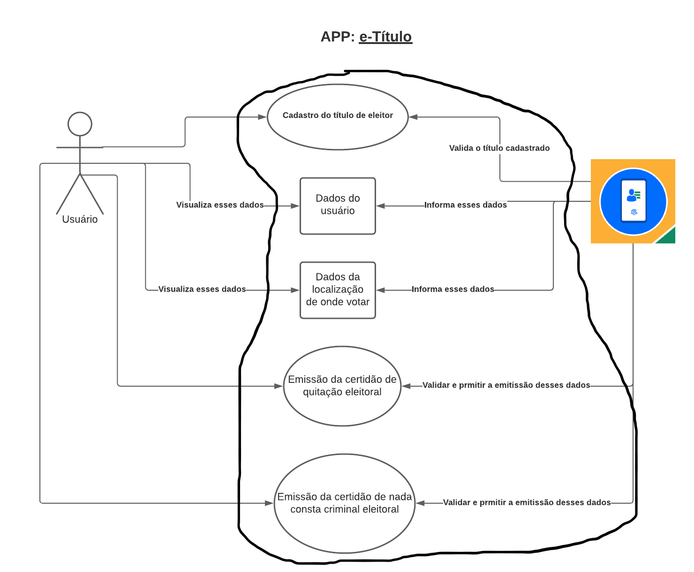
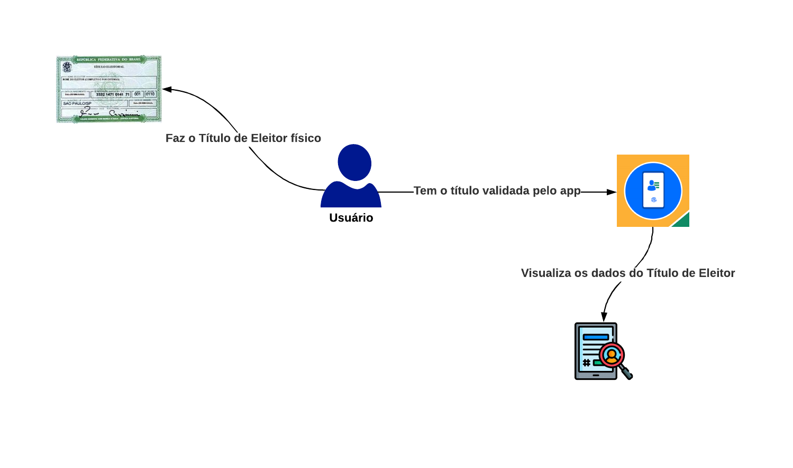
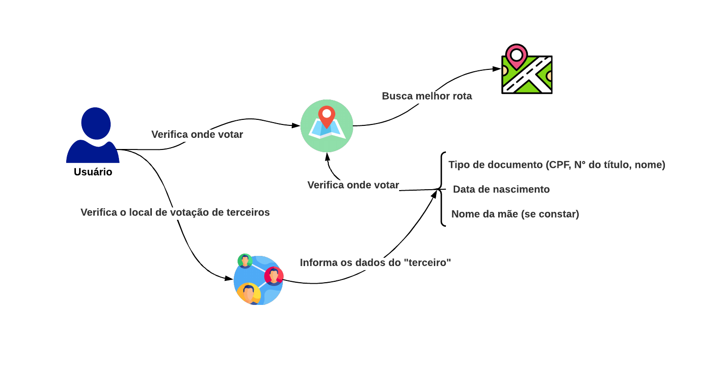

# RichPicture

Um Rich Picture é um artefato construído a fim de ilustrar e, assim, trazer uma melhor compreensão do problema a ser resolvido pela equipe de desenvolvimento.

- Desenvolvida utilizando a ferramenta LucidChart

## Versão 1.0 do RichPicture

 
  
<figcaption>Figura 1 - RichPicture inicial</figcaption>

## Versão 2.0 do RichPicture

Após as consideração feitas pela o professor e um estudo mais aprofundado, foi criado um RichPicture para cada característica e atores que localizamos no aplicativo e-Título.

### RP1 - Visão Geral

 
  
<figcaption>Figura 2 - RichPicture: Visão Geral</figcaption>

### RP2 - Usuários

  
<figcaption>Figura 3 - RichPicture: Usuários</figcaption>

### RP3 - Onde Votar

  
<figcaption>Figura 4 - RichPicture: Onde Votar</figcaption>

### RP4 - Funções Adicionais

  
<figcaption>Figura 5 - RichPicture: Funções Adicionais</figcaption>

### RP5 - Configurações

  
<figcaption>Figura 6 - RichPicture: Configurações</figcaption>

## Referências Bibliográficas
>TOLFO, C. O uso de rich picture como recurso didático baseado no pensamento visual. Universidade Federal do Pampa, Brasil. Publicado: 04/10/2019

## Versionamento
| Versão | Data | Modificação | Autor |
|--|--|--|--|
| 1.0 | 11/02/2021 | Criação do rich picture versão 1.0 | Ian |
| 1.1 | 10/03/2021 | Criação do rich picture versão 2.0 | Ian |
| 1.2 | 31/03/2021 | Adicionando legenda nas imagens após feedback do professor e monitores | Ian |